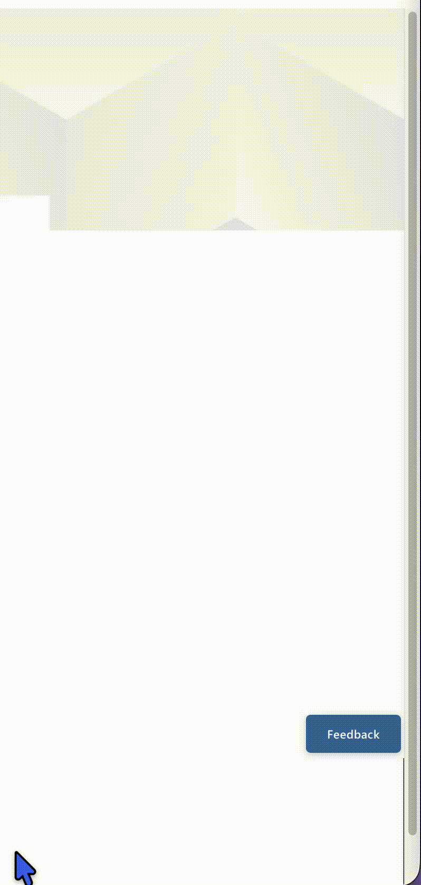

# Feedback Tab — SPFx Web Part

A SharePoint Framework (SPFx) web part that adds a **floating Feedback tab** to any SharePoint modern page. Once added to a page, the web part itself is invisible — it renders a fixed-position button in the lower-right corner of the browser window. Clicking it opens a slide-in side panel containing a fully configurable feedback form.



---

## Features

- **Fixed floating tab** — stays in the lower-right corner of the viewport regardless of where the web part is placed on the page layout
- **Slide-in side panel** — smooth animation, backdrop overlay, Escape key and click-outside to close
- **Configurable feedback form** with:
  - Form title
  - Form description (toggle on/off)
  - Question label (toggle on/off)
  - Comment text area with custom placeholder
  - Optional 5-star rating (toggle on/off)
  - Custom submit button text
  - Custom success message
- **Tab appearance controls** — filled (solid blue) or outlined (white with blue border) style, font size, width, and height all configurable from the property pane
- **Automatic list creation** — on first load, the web part checks for a SharePoint list named `Feedback Responses` and creates it automatically if it doesn't exist
- **Automatic data capture** — page URL, page title, site URL, submission timestamp, and submitting user are all recorded without any user input
- **Accessible** — keyboard navigable, ARIA labels, focus management, loading/success/error states
- **Prevents duplicate submissions** while a request is in progress

---

## Feedback Responses List

Submitted feedback is saved to a SharePoint list named **`Feedback Responses`** in the same site where the web part is deployed. The list is created automatically on first page load (requires Site Owner permissions). It stores:

| Column | Description |
| --- | --- |
| Title | Auto-generated label (e.g. `Feedback - Mar 22, 2026`) |
| CommentText | The comment entered by the user |
| Rating | Star rating 1–5 (blank if star rating is disabled) |
| PageURL | Full URL of the page where feedback was submitted |
| PageTitle | Title of the SharePoint site |
| SiteURL | Root URL of the site collection |
| SubmittedDateTime | ISO timestamp of submission |
| Created By | Submitting user — captured automatically by SharePoint |

---

## Property Pane Settings

All of the following are editable in SharePoint edit mode via the web part property pane:

| Setting | Description |
| --- | --- |
| Feedback tab label | Text shown on the floating button |
| Tab style | Filled (blue) or Outlined (white/blue) |
| Tab font size (px) | Font size of the tab label |
| Tab width (px) | Width of the tab button (slider) |
| Tab height (px) | Height of the tab button (slider) |
| Form title | Heading shown at the top of the panel |
| Show form description | Toggle to show/hide the description line |
| Form description | Helper text below the title |
| Show question label | Toggle to show/hide the question label |
| Question label | Label shown above the comment field |
| Comment placeholder | Placeholder text inside the comment box |
| Enable star rating | Toggle to show/hide the star rating control |
| Submit button text | Label on the submit button |
| Success message | Message shown after a successful submission |

---

## Solution

| | |
| --- | --- |
| **Solution** | custom-feedback |
| **Framework** | SharePoint Framework 1.20.0 |
| **React version** | 17.0.1 |
| **Fluent UI** | @fluentui/react 8.x |
| **Compatibility** | SharePoint Online modern pages |

---

## Version History

| Version | Date | Comments |
| --- | --- | --- |
| 1.0.5 | March 2026 | Fix feedback submission (SPHttpClient import correction) |
| 1.0.4 | March 2026 | App catalog name, icon, and description polish |
| 1.0.3 | March 2026 | Custom app catalog icon |
| 1.0.2 | March 2026 | Web part display name and Fluent UI icon |
| 1.0.1 | March 2026 | Fixed SPHttpClient configuration (list auto-creation) |
| 1.0.0 | March 2026 | Initial release |

---

## Prerequisites

- SharePoint Online (Microsoft 365)
- Node.js 18.x
- The deploying user must have **Site Owner** (or higher) permissions on the target site for the `Feedback Responses` list to be created automatically on first load. If auto-creation fails, the list can be created manually — see below.

---

## Minimal Path to Awesome

### Run locally (gulp serve)

```bash
git clone https://github.com/j-scott-hg/spfx-feedback-tab-webpart.git
cd spfx-feedback-tab-webpart
npm install
gulp serve
```

This opens the hosted SharePoint workbench at `https://<YOUR-TENANT>.sharepoint.com/_layouts/workbench.aspx`. Add the **Feedback Tab** web part from the toolbox to test it.

### Deploy to SharePoint

```bash
npm install
gulp bundle --ship
gulp package-solution --ship
```

Upload `sharepoint/solution/custom-feedback.sppkg` to your **SharePoint App Catalog**, click **Deploy**, then add the **Feedback Tab** web part to any modern SharePoint page.

---

## Manual List Creation

If the list is not auto-created (e.g. the first page load was by a user without list-creation permissions), open the browser console on any SharePoint page on the target site and run the following:

**Step 1 — Get request digest**
```javascript
const digestResp = await fetch("https://<YOUR-TENANT>.sharepoint.com/sites/YOUR-SITE/_api/contextinfo", {
  method: "POST",
  headers: { "Accept": "application/json;odata=nometadata" },
  credentials: "include"
});
const digestData = await digestResp.json();
const digest = digestData.FormDigestValue;
```

**Step 2 — Create the list**
```javascript
const siteUrl = "https://<YOUR-TENANT>.sharepoint.com/sites/YOUR-SITE";
await fetch(`${siteUrl}/_api/web/lists`, {
  method: "POST", credentials: "include",
  headers: {
    "Accept": "application/json;odata=nometadata",
    "Content-Type": "application/json;odata=nometadata",
    "X-RequestDigest": digest
  },
  body: JSON.stringify({ Title: "Feedback Responses", BaseTemplate: 100 })
});
```

**Step 3 — Add columns**
```javascript
const baseUrl = `${siteUrl}/_api/web/lists/getbytitle('Feedback%20Responses')/fields`;
const columns = [
  { FieldTypeKind: 3, Title: "CommentText" },
  { FieldTypeKind: 9, Title: "Rating" },
  { FieldTypeKind: 2, Title: "PageURL" },
  { FieldTypeKind: 2, Title: "PageTitle" },
  { FieldTypeKind: 2, Title: "SiteURL" },
  { FieldTypeKind: 4, Title: "SubmittedDateTime" }
];
for (const col of columns) {
  await fetch(baseUrl, {
    method: "POST", credentials: "include",
    headers: {
      "Accept": "application/json;odata=nometadata",
      "Content-Type": "application/json;odata=nometadata",
      "X-RequestDigest": digest
    },
    body: JSON.stringify(col)
  });
}
```

---

## Disclaimer

**THIS CODE IS PROVIDED *AS IS* WITHOUT WARRANTY OF ANY KIND, EITHER EXPRESS OR IMPLIED, INCLUDING ANY IMPLIED WARRANTIES OF FITNESS FOR A PARTICULAR PURPOSE, MERCHANTABILITY, OR NON-INFRINGEMENT.**
